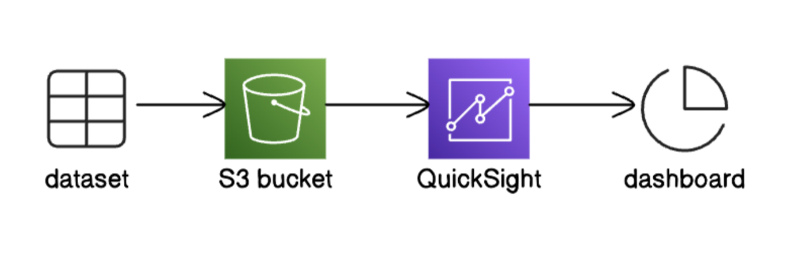

# Visualize Data with Amazon QuickSight

This project showcases how I used **Amazon QuickSight** to analyze a Netflix dataset and generate visual dashboards. The dataset was stored in Amazon S3 and connected to QuickSight using a `manifest.json` configuration.

## 🔁 Data Flow Diagram

Below is the high-level architecture of this project:

## 🚀 What I Did

- Uploaded a dataset (`netflix_titles.csv`) and a `manifest.json` file to an **Amazon S3** bucket.
- Created a **QuickSight** account and connected it to S3 using the manifest.
- Built visualizations like bar charts to analyze data such as release year and content type.
- Applied filters to highlight specific genres like *Action & Adventure*, *TV Comedies*, and *Thrillers*.
- Exported the final dashboard as a **PDF**.

## 🧠 Key Learnings

- QuickSight’s drag-and-drop interface makes it very easy to build visualizations.
- A properly formatted `manifest.json` is critical for connecting S3 data to QuickSight.
- Exporting dashboards makes sharing and presenting insights simple.

## 📎 Documentation

Full walkthrough available here:

[📄 Visualize Data with QuickSight.pdf](./Visualize%20Data%20with%20QuickSight.pdf)